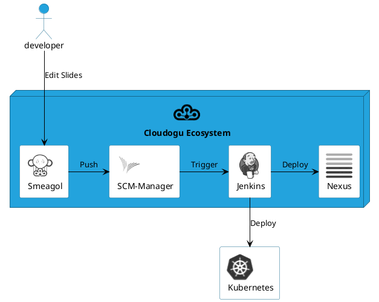

# 总体架构

``` plantuml
@startuml
!include <cloudogu/common>
!include <cloudogu/dogus/jenkins>
!include <cloudogu/dogus/cloudogu>
!include <cloudogu/dogus/scm>
!include <cloudogu/dogus/smeagol>
!include <cloudogu/dogus/nexus>
!include <cloudogu/tools/k8s>

node "Cloudogu Ecosystem" <<$cloudogu>> {
	DOGU_JENKINS(jenkins, Jenkins) #ffffff
	DOGU_SCM(scm, SCM-Manager) #ffffff
	DOGU_SMEAGOL(smeagol, Smeagol) #ffffff
	DOGU_NEXUS(nexus,Nexus) #ffffff
}

TOOL_K8S(k8s, Kubernetes) #ffffff

actor developer

developer --> smeagol : "Edit Slides"
smeagol -> scm : Push
scm -> jenkins : Trigger
jenkins -> nexus : Deploy
jenkins --> k8s : Deploy
@enduml

``` 

``` plantuml
@startuml
!include <cloudogu/common>
!include <cloudogu/dogus/jenkins>
!include <cloudogu/dogus/cloudogu>
!include <cloudogu/dogus/scm>
!include <cloudogu/dogus/smeagol>
!include <cloudogu/dogus/nexus>
!include <cloudogu/tools/k8s>

node "Cloudogu Ecosystem" <<$cloudogu>> {
	DOGU_JENKINS(jenkins, Jenkins) #ffffff
	DOGU_SCM(scm, SCM-Manager) #ffffff
	DOGU_SMEAGOL(smeagol, Smeagol) #ffffff
	DOGU_NEXUS(nexus,Nexus) #ffffff
}

TOOL_K8S(k8s, Kubernetes) #ffffff

actor developer

developer --> smeagol : "Edit Slides"
smeagol -> scm : Push
scm -> jenkins : Trigger
jenkins -> nexus : Deploy
jenkins --> k8s : Deploy
@enduml

``` 